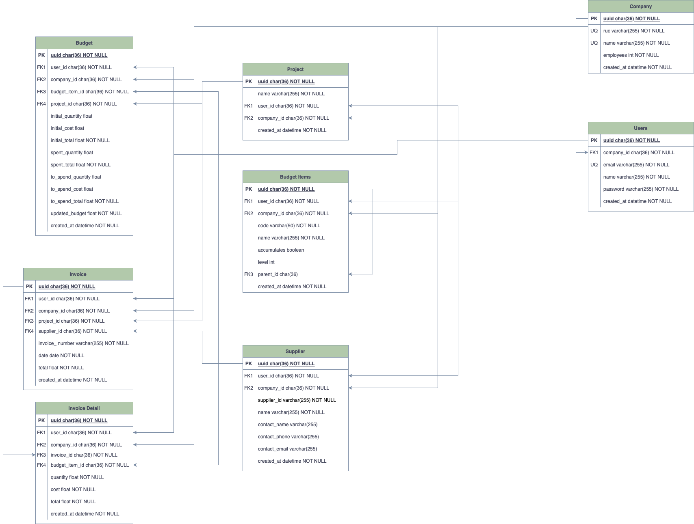

# <center style="font-size: 3rem;">**SCP API**</center>


\

## Your budgeting api focused in construction companies
## Overview
This is the backend of SCP, it is build in Python using fast-api.

<hr style="border: 2px solid gray;" />

## Features

> Create a company with admin user\
> Create users for a company\
> Create projects\
> Create budget items\
> Create suppliers\
> Create the budgets\
> Create invoices\
> Updates de budget 
<hr style="border: 2px solid gray;" />

## Database structure

### <center>Entity Relationship Diagram</center>


## Future version features

> Authorization module - what can each user do
<hr style="border: 2px solid gray;" />

## Installation Instructions

- Clone the project
- run to install all the libraries required
```
pip install
``` 
- Configure your .env file with the variables shown in the Environment variables section 
- Install postgres
- To create all the database tables, run the following command
```
alembic upgrade heads
``` 
<hr style="border: 2px solid gray;" />
### Environment variables

The following are the required environment variables required for the app to
work

- **DATABASE_HOSTNAME**: It's the host where the Postgres Database is deployed
- **DATABASE_USERNAME**:  It's the username with access to the Postgres Database
- **DATABASE_PASSWORD**:  It's the user's password to gain access to the database
- **DATABASE_PORT**:  It's the port in which the database listens for connection
- **DATABASE_NAME**: It's the actual name of the database that we will be querying
---
- **SECRET_KEY**: It's the secret key that we will use to sign the tokens
- **ALGORITHM**: It's the algorithm employed to sign the tokens
- **ACCESS_TOKEN_EXPIRE_MINUTES**: It's the time in minutes that will take for the token to expire

